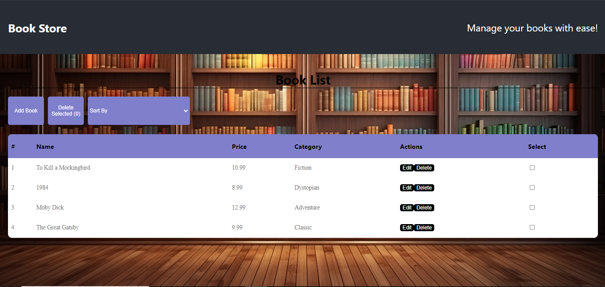

#Mini-Books-library

This project was created to demonstrate my front-end development skills for a company. It is a React application, bootstrapped with [Create React App](https://github.com/facebook/create-react-app).

## Table of Contents

- [Project Description](#project-description)
- [Features](#features)
- [Installation](#installation)
- [Usage](#usage)
- [Screenshots](#screenshots)
- [Contact Information](#contact-information)

## Project Description

The purpose of this project is to showcase my abilities in front-end development, including building user interfaces, managing state, and handling routing in a React application.

## Features

- Responsive design
- User-friendly interface
- State management using React hooks
- Routing with React Router
- Managing Books in library
  

## Installation

To install and run this project locally, follow these steps:

1. Clone the repository:
   ```sh
   git clone https://github.com/djemaouiahmed/front-exam.git
2. Install dependesi
   ```sh
   npm install
   
## Usage 
1. Start the app
    ```sh
   npm start

3. Open the url:
 http://localhost:3000 
4. Or you  can check the deployment

To view the deployed application, [visit: Front Exam](https://djemaouiahmed.github.io/front-exam/)

## Screenshots

1. App interface


## Contact Information
For any inquiries or feedback, feel free to contact me at:

- Email: your.email@example.com
- GitHub: djemaouiahmed

## Learn More

You can learn more in the [Create React App documentation](https://facebook.github.io/create-react-app/docs/getting-started).

To learn React, check out the [React documentation](https://reactjs.org/).
